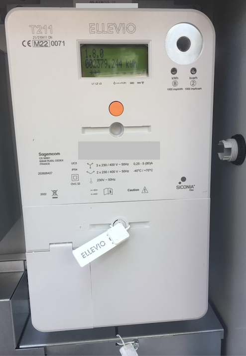

---
hide:
    - navigation # Hide navigation
---

# Mätare

En samling av de mätare som används i Sverige och vart HAN-porten sitter på dem.

## Aidon 6534 

HAN-porten sitter på högra sidan över terminalluckan.

## Iskra AM550

HAN-porten är märkt med P1 och sitter uppe i högra hörnet på mätaren. E.ON kan ej aktivera HAN-porten på denna modell.

## Kaifa MA304

HAN-porten sitter under en gummilucka till vänster på mätarens framsida. Det finns både versioner med den svenska och norska standarden ute hos olika elnätsbolag.

## Landis & Gyr E360

Det finns flera modeller och versioner av Landis & Gyr E360. Dels finns det en enfasmodell och en trefasmodell. Trefasmodellen finns i åtminstone två versioner med olika placering av HAN-porten. Åtminstone [E.ON använder två versioner som de kallar 1.0 och 2.0](https://www.eon.se/el/elnat/sa-fungerar-din-smarta-elmatare).

Om det finns en lucka till vänster som på bilderna ovan så sitter HAN-porten under den, skyddad av en bit gummi som går att dra ut. Saknas lucka så finns HAN-porten på undersidan av mätarens tjockaste del, skyddad av en plastlucka som går att skjuta i djupled för att komma åt porten.

## Sagemcom S211

HAN-porten sitter under luckan i nedre vänstra hörnet.

## Sagemcom T211

HAN-porten sitter under luckan i nedre vänstra hörnet.

## SanXing S34U18

HAN-porten sitter under den grå luckan nere till höger.
